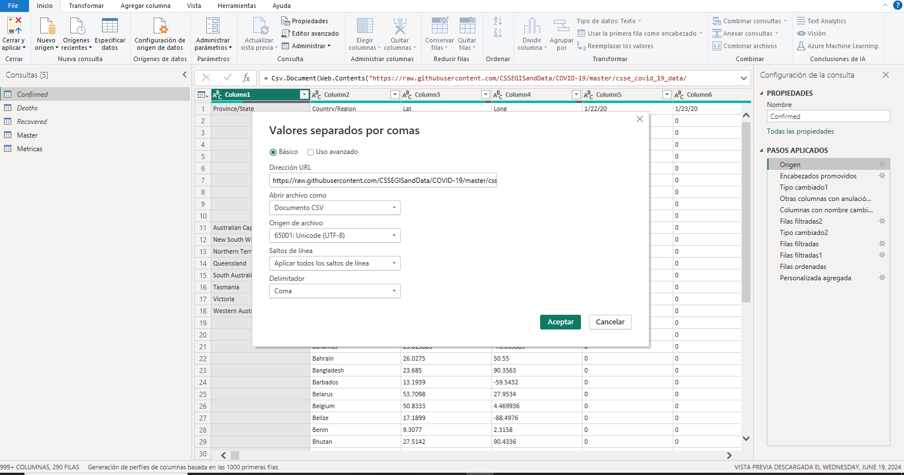
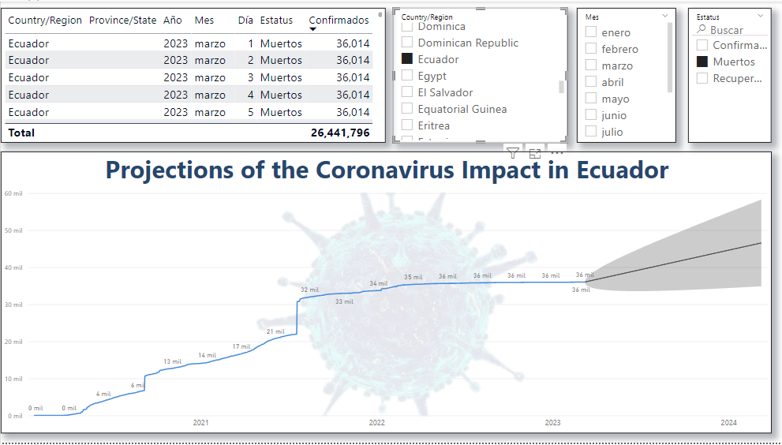
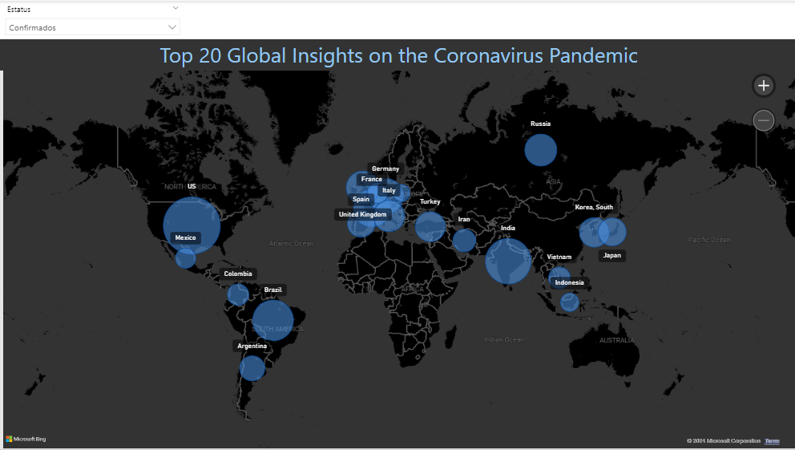
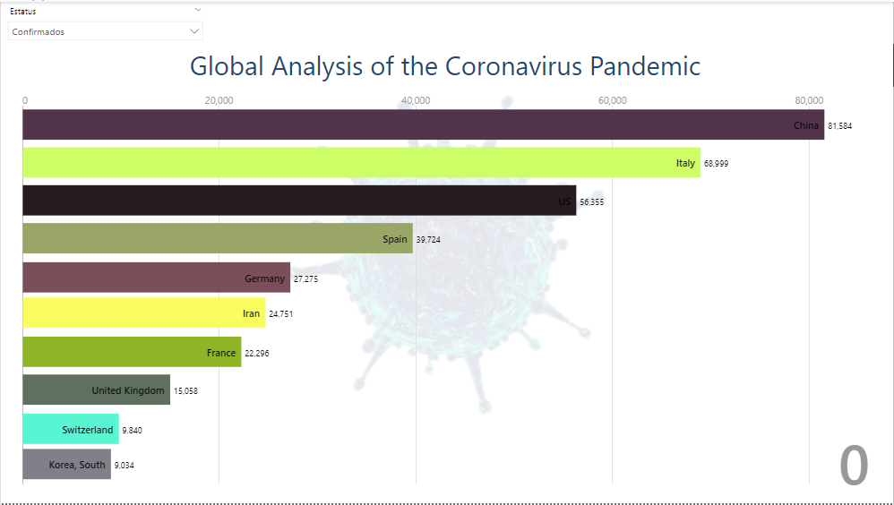
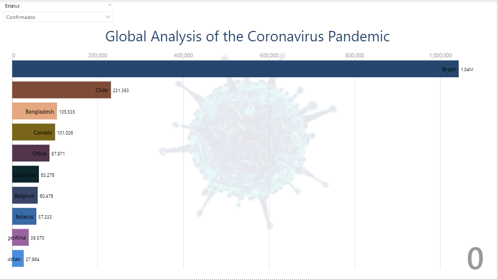

# Informe Power BI a cerca de la evolucion del cornavirus en el Ecuador y en el mundo.

## Explicacion

To generate these graphs, I integrated data from an official COVID-19 dataset hosted on GitHub. The dataset is sourced from the Johns Hopkins University Center for Systems Science and Engineering (JHU CSSE). Here are the steps I followed:

Data Source: I used the URL https://raw.githubusercontent.com/CSSEGISandData/COVID-19/master/csse_covid_19_data/csse_covid_19_time_series/time_series_covid19_confirmed_global.csv to access the CSV file containing global confirmed COVID-19 cases.

Data Import: In Power BI, I imported the data using the "Web" option in the "Get Data" menu. I pasted the URL of the CSV file, allowing Power BI to fetch the data directly from the GitHub repository.

Data Processing:

I promoted the first row as headers.
Changed data types to ensure correct interpretation of the data.
Removed unnecessary columns and filtered rows to focus on relevant data.
Renamed columns for better clarity.
Applied filters to show specific countries, dates, and statuses (confirmed, deaths, recovered).
Data Transformation: Various transformation steps were applied to clean and organize the data, such as sorting, grouping, and aggregating the data to prepare it for visualization.

Visualization: Using Power BI's visualization tools, I created graphs and charts to represent the data. This includes time series graphs showing the progression of COVID-19 cases in different regions and specific projections for countries like Ecuador.

This process ensures that the visualizations are based on up-to-date and accurate data from a reliable source, providing clear insights into the impact of COVID-19 globally and in specific regions.

Graph Description:
The graph shows the trend and forecast of confirmed COVID-19 cases in Ecuador from 2020 to 2024. It starts with a steady increase in cases, reaching about 36,014 by 2023. The shaded area projects a range of possible future cases up to 2024.

Summary:
The graph depicts the growth of COVID-19 cases in Ecuador, rising to 36,014 by 2023, with projections showing potential variations in 2024.

Graph Description:
The image (Global Insights) focuses on the top 20 countries with the most significant COVID-19 cases. The map visualization provides a geographical representation of the pandemic's spread, making it easier to identify hotspots and the scale of infections in different regions.
Summary:
This visualization offers key insights into the global spread of the coronavirus by highlighting the top 20 most affected countries. The map illustrates the geographical distribution and intensity of the pandemic, emphasizing regions like North America, South America, and Europe as major hotspots. Such insights are essential for global health organizations and policymakers to strategize and implement effective measures to combat the pandemic.

Graph Description:

The set of images (image-5.png,image-6.png) provides a comprehensive view of the number of confirmed COVID-19 cases in various countries worldwide. The bar charts display the countries with the highest number of confirmed cases, illustrating the global impact and spread of the pandemic.
Summary:
This analysis presents a detailed examination of the coronavirus pandemic's reach across the globe. By comparing the number of confirmed cases in different countries, we can observe which regions have been most affected. The data highlights the significant challenges faced by countries like the United States, Brazil, and India, which have reported the highest numbers of confirmed cases. This visualization is crucial for understanding the pandemic's global footprint and the varying degrees of its impact across different nations.